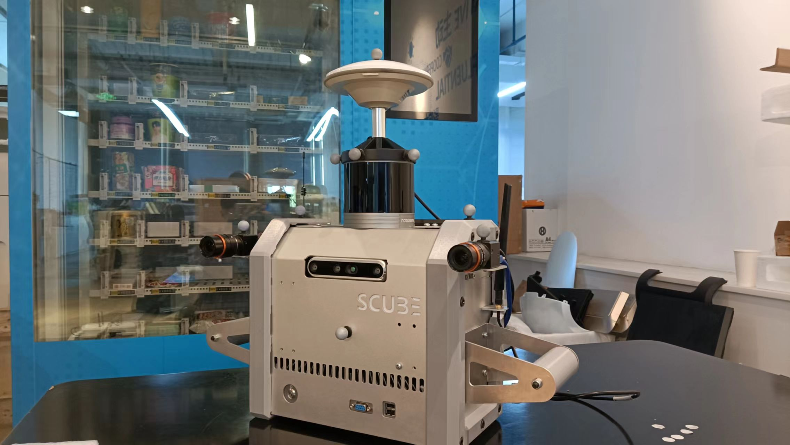
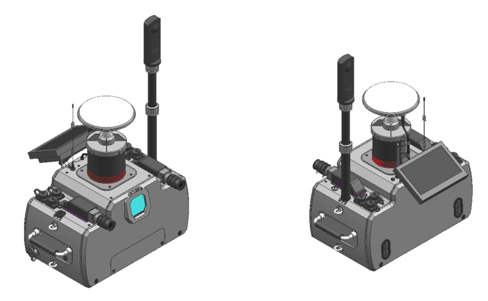

# SensorCube

SensorCube is a hardware and software toolbox for localization, perception, and navigation of all-source sensors.

This project is jointly promoted and maintained by the MSP Group of Shanghai Jiao Tong University and Shanghai Slamtec Co., LTD.

NOTE: We are still working on relevant documents, materials and codes, and we are sorry that the full source material may not be ready until the end of 2023. If you have any questions to consult, please contact Liu Guoqing ( guoqing_liu@sjtu.edu.cn ) , thanks.

# Overview

Engineering prototype ↓

Prototype in test ↓

# Supported Sensors

- LiDAR

    - RoboSense RS-Helios-1615 
    - Livox Mid-70

- Camera

    - Cameras: 2 x HIK Robot MV-CA013-A0UC / MV-CA013-A0UM
    - Lens: 2 x HIK HF0628M-6MPE / HF1228M-6MPE
    - RICOH Theta Z1
    - (Deprecated) Intel RealSense D455

- IMU

    - Xsens Mti-300 2A8G4
    
- GNSS Receiver

    - Novatel OEM 617D / 719, use the CORS service provided by Qianxun SI.

All sensors' data was synchronized by hardware and software, except RICOH camera.

# Maintainer

Please note that the open source material is still under development.  If you have any questions to consult, please contact Liu Guoqing ( guoqing_liu@sjtu.edu.cn ) , thanks.

